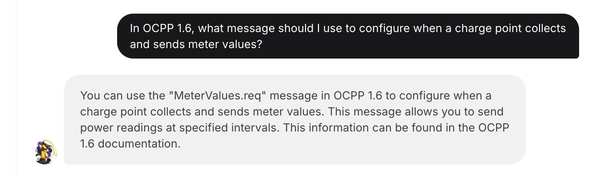
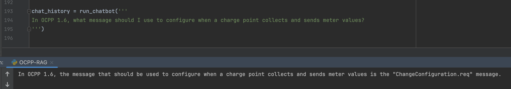
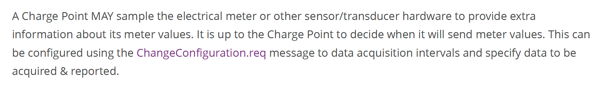
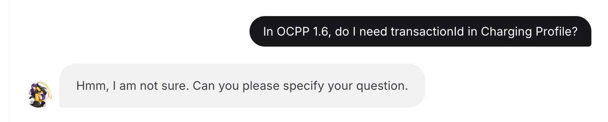
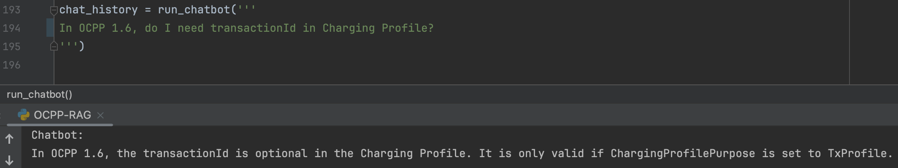
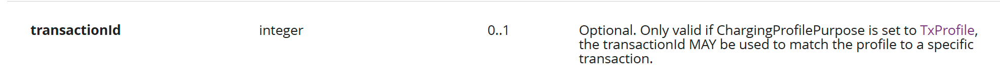

# RAG Application Chatbot Prototype

## Architecture
- **LLM**: Cohere Command R+
- **Embedding model**: embed-english-v3.0
- **Reranking model**: rerank-english-v3.0

## Data
- OCPP 1.6 (HTML format)
- WebSocket API documentation
- Any HTML-based document can be added based on the application purpose

## What this application does

Command R+ model is designed with RAG (Retrieval-Augmented Generation) in mind. 
This application is built to parse information from OCPP 1.6, WebSocket documentation, and essentially any documents available online and precisely answer user's questions.

Based on my tests, it performs better than a ChatGPT-based chatbot offered at the [Open Charge Alliance website](https://openchargealliance.org/oca-i-chatbot/).

## Examples

### Example 1

**Official chatbot:**

**This application:**

**Correct answer:**

### Example 2

**Official chatbot:**

**This application:**

**Correct answer:**
